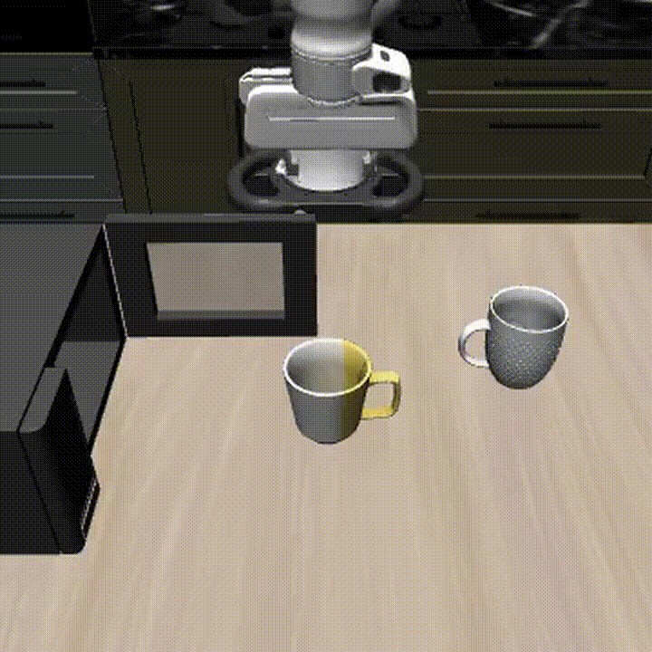

# Terminal-Driven Robotic Manipulation with Pi0.5, LeRobot, LIBERO, and MuJoCo

This project demonstrates a terminal-driven Vision-Language-Action robotic manipulation workflow using a LIBERO-finetuned Pi0.5 policy through LeRobot.

A user can list supported LIBERO natural-language manipulation commands, manually enter one available instruction, and execute the corresponding manipulation task in simulation. The system maps the instruction to a LIBERO task ID, loads the pretrained/fine-tuned Pi0.5 policy, runs the rollout in a MuJoCo/robosuite environment, and saves the generated robot behavior as a video.

## Demo

Successful task:

- Policy: `lerobot/pi05_libero_finetuned`
- Suite: `libero_10`
- Task ID: `9`
- Instruction: `put the yellow and white mug in the microwave and close it`
- Simulator: LIBERO / MuJoCo / robosuite
- Execution platform: Kaggle GPU

Click the preview to open the full MP4 demo.
